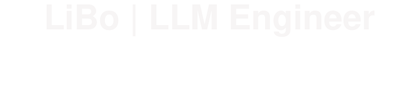

<!-- typing animation -->

  

<!-- about me -->

  
  
  

---

### 🧠 About Me

- 🔥 LLM Algorithm Engineer — Pre-training, SFT, RLHF, Inference Optimization
- 🏗️ Building & optimizing large-scale model training & serving pipelines
- ⚡ Passionate about making models faster, smarter, and more efficient
- 🌱 Currently exploring: MoE architectures, long-context techniques, speculative decoding

---

### 🛠️ Tech Stack

<table>
<tr>
<td width="160"><strong>Languages</strong></td>
<td>
  
  
  
  
</td>
</tr>
<tr>
<td><strong>Training</strong></td>
<td>
  
  
  
  
  
</td>
</tr>
<tr>
<td><strong>Inference</strong></td>
<td>
  
  
  
  
</td>
</tr>
<tr>
<td><strong>Tooling</strong></td>
<td>
  
  
  
  
  
</td>
</tr>
</table>

---

